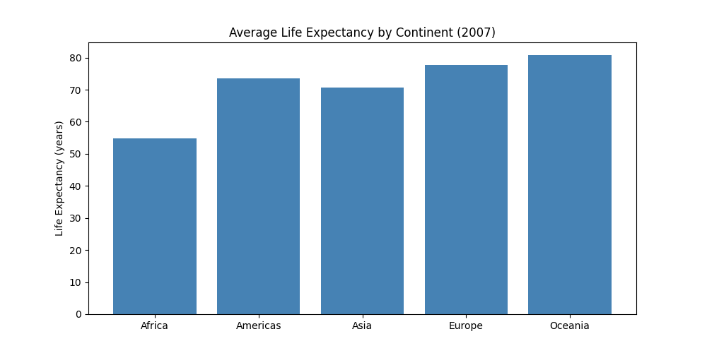
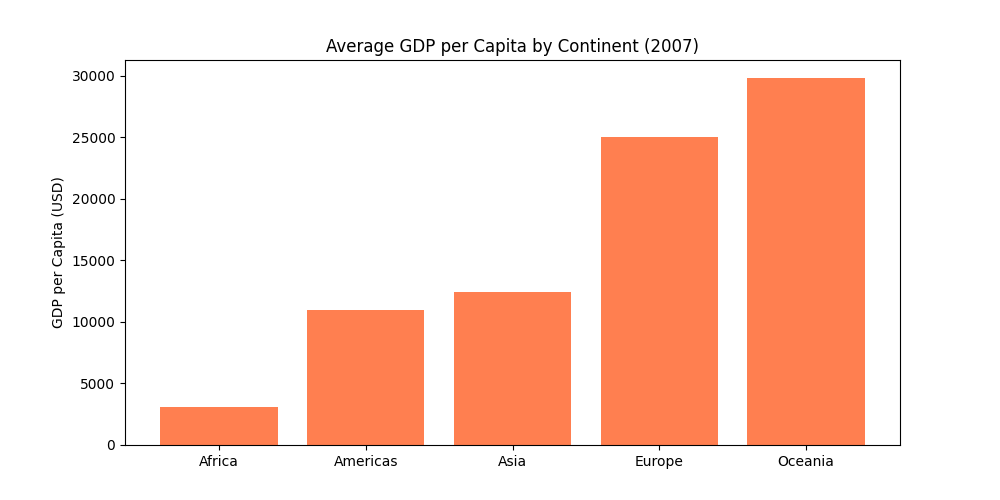

# Gapminder Analysis API

A production-style REST API analyzing the Gapminder dataset (1952–2007) using Python, FastAPI, and scikit-learn.

## Features
- Concurrent data processing using ThreadPoolExecutor
- REST API with 4 endpoints (FastAPI)
- ML model predicting life expectancy from GDP
- Data visualizations (matplotlib)
- Dockerized deployment
- Automated tests with pytest (3/3 passing)

## Tech Stack
Python, FastAPI, scikit-learn, pandas, matplotlib, Docker, pytest

## API Endpoints
- `GET /` - Health check
- `GET /analysis?year=2007` - Continent stats (concurrent processing)
- `GET /continents` - Available years
- `GET /predict?gdp_per_cap=5000` - Predict life expectancy

## Run Locally
```bash
pip install -r requirements.txt
python -m uvicorn main:app --reload
```

## Run with Docker
```bash
docker-compose up
```

## Tests
```bash
python -m pytest tests/ -v
```

## Visualizations


